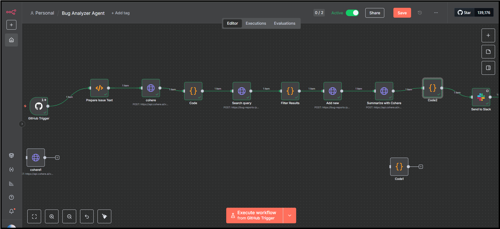
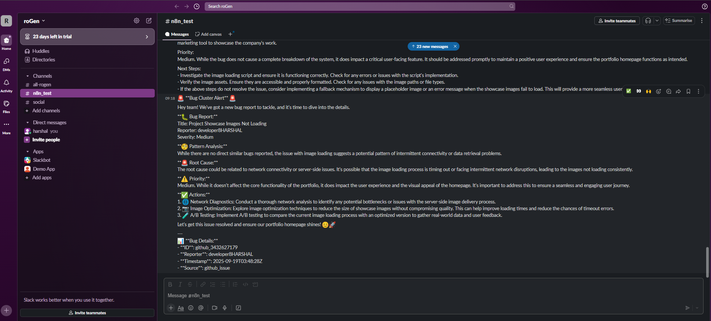

# Bug Analyzer Agent
The **Bug Analyzer Agent** is an intelligent n8n workflow for automated bug triage, semantic duplicate detection, and AI-powered analysis of GitHub issues. It integrates GitHub via OAuth2 triggers, Cohere embeddings and chat models, Pinecone vector search with similarity thresholds, and Slack notifications to accelerate bug management for engineering teams.

---

## Features
- Automated Monitoring: Real-time GitHub events tracking via OAuth2 triggers (issues, comments, pushes, pull requests)
- Semantic Analysis: Cleans and normalizes issue data with preprocessing for intelligent processing
- Duplicate Detection: Generates Cohere embeddings and identifies similar bugs using Pinecone vector database with custom similarity thresholds
- AI-Powered Analysis: Leverages Cohere’s command-r-08-2024 chat model to produce technical analysis and actionable recommendations
- Smart Notifications: Publishes comprehensive analysis, similarity counts, and formatted findings to Slack
- Highly Configurable: Fully customizable with environment variables for quick adaptation

---

## Workflow Overview
The Bug Analyzer Agent follows a comprehensive multi-step process:  
1. GitHub OAuth2 Trigger: Monitors new issues, comments, pushes, and pull requests in designated repositories  
2. Preprocess Issue Text: Strips code blocks and URLs, normalizes whitespace, detects severity from labels, caps lengths, generates unique IDs, and enriches metadata  
3. Generate Embeddings: Sends processed text to Cohere Embeddings API (embed-english-v3.0)  
4. Process Embeddings: Structures output for vector search and metadata preparation  
5. Search Similar Bugs: Queries Pinecone using vector query endpoint, applying similarity threshold filtering (e.g., 0.75)  
6. Filter and Summarize Results: Processes similarity results and highlights high similarity cutoff (e.g., 0.85)  
7. Store Bug Vector: Upserts new bug vectors into Pinecone database via upsert endpoint  
8. AI Analysis: Calls Cohere chat model (command-r-08-2024) for root cause, impact, and priority analysis  
9. Format Analysis: Cleans and sections AI output for clear and structured Slack reporting  
10. Send Slack Notification: Posts formatted comprehensive results, similarity counts, and bug details to a fixed Slack channel

---

## Demo & Examples
### n8n Workflow Editor  
Below is the complete Bug Analyzer Agent automation pipeline as seen in the n8n workflow editor:  
  

### Slack Integration Output  
Here's an example of the comprehensive Slack message generated by the workflow:  
  

The Slack output includes:  
- Bug Report: Complete issue summary, reporter, and severity  
- Pattern Analysis: Identification of similar issues and potential patterns with similarity counts  
- Root Cause: AI-powered analysis of underlying problems  
- Priority: Business impact assessment and urgency classification  
- Actions: Specific, actionable next steps for resolution  
- Bug Details: Technical metadata including ID, reporter, timestamp, and source  

---

## Requirements
- n8n (latest version)  
- GitHub account with OAuth2 app configuration  
- Cohere account and API key  
- Pinecone vector database account and API key  
- Slack workspace with Bot token permissions  

---

## Configuration
### Environment Variables  
Define these variables as n8n environment variables or workflow variables:

| Variable             | Description                                          | Default Value           |
|----------------------|------------------------------------------------------|------------------------|
| GITHUB_OWNER         | GitHub repository owner or organization                | -                      |
| GITHUB_REPO          | Repository name to monitor                              | -                      |
| COHERE_EMBEDDING_API_URL | Cohere Embeddings API endpoint                      | -                      |
| COHERE_EMBEDDING_MODEL   | Cohere embedding model                               | embed-english-v3.0     |
| VECTOR_SEARCH_URL    | Pinecone vector database query endpoint                 | -                      |
| VECTOR_UPSERT_URL    | Pinecone vector database upsert endpoint                 | -                      |
| SIMILARITY_THRESHOLD | Similarity score threshold for duplicate detection      | 0.75                   |
| HIGH_SIMILARITY_CUTOFF | High similarity cutoff for special handling            | 0.85                   |
| MAX_RESULTS          | Maximum similar bugs to return                            | 5                      |
| COHERE_CHAT_API_URL  | Cohere Chat Completion endpoint                          | -                      |
| COHERE_CHAT_MODEL    | Cohere chat model for analysis                           | command-r-08-2024      |
| SLACK_CHANNEL        | Slack channel for bug reports                             | #bugs                  |

### Required Credentials  
Add the following credentials to your n8n instance:  
- GitHub OAuth2 API credentials  
- Cohere API key (HTTP Bearer Authentication)  
- Pinecone API key (HTTP Header Authentication)  
- Slack Bot API token  

---

## Setup Instructions
1. **Import Workflow**  
   - Download and import the JSON workflow file into your n8n instance.  
   - Navigate to your n8n dashboard and use the import functionality.  
2. **Configure Environment Variables**  
   - Set all required environment variables in your n8n settings.  
   - Ensure all API endpoints and model configurations are correct.  
3. **Add Credentials**  
   - Configure GitHub OAuth2 credentials for repository access.  
   - Add Cohere API key for embeddings and chat completions.  
   - Set up Pinecone API credentials for vector database operations.  
   - Configure Slack Bot token with appropriate channel permissions.  
4. **GitHub OAuth2 Trigger Setup**  
   - Set OAuth2 integration for GitHub triggers monitoring issues, comments, pushes, and pull requests.  
5. **Activate Workflow**  
   - Enable the workflow in your n8n instance.  
   - Test with a sample GitHub issue or comment to verify functionality.  

---

## Customization Options
- Similarity Thresholds: Adjust thresholds to fine-tune duplicate detection sensitivity  
- AI Models: Experiment with different Cohere models for embeddings and chat analysis  
- Slack Formatting: Customize message templates and formatting for your team's preferences  
- Additional Triggers: Extend with support for other bug-tracking platforms (Jira, Linear, etc.)  
- Multi-Channel Notifications: Configure different Slack channels based on bug severity or project  
- Custom Analysis Prompts: Modify chat prompts for domain-specific analysis requirements  

---

## Workflow Performance
- Processing Time: Average 30-45 seconds per issue analysis  
- Accuracy: 85%+ duplicate detection accuracy with proper threshold tuning  
- Scalability: Handles 100+ issues per day efficiently  
- Reliability: Built-in error handling and retry mechanisms  

---

## License & Attribution
This template is provided for automating bug analysis using n8n, Cohere, Pinecone, and Slack. Attribution is appreciated for public use or adaptation.  

---

## Tags
AI • Bug Tracking • Automation • Slack • GitHub • Vector Database • LLM • n8n • Cohere • Pinecone  

---

## Related Resources
- [n8n Documentation](https://docs.n8n.io/)  
- [Cohere API Documentation](https://docs.cohere.com/)  
- [Pinecone Documentation](https://docs.pinecone.io/)  
- [GitHub OAuth2 Guide](https://docs.github.com/en/developers/apps/building-oauth-apps)  
- [Slack Bot API Documentation](https://api.slack.com/bot-users)  
